# Activitat Avaluable - MP06 - UF02

## dilluns, 8 de febrer de 2021 (DAW2)

Aquesta activitat servià per poder valorar si l'alumne ha assolit els coneixement.

Es tracta de fer un clone d'aquest repositori i anar seguint totes les seccions, i a mesura que l'alumne vagi fent el que es demana a cada secció, l'alumne anirà sumant punts.


### Comandes per validar la configuració de ***```git```***
```git
$ git config --global user.name "John Doe"
$ git config --global user.email johndoe@example.com
```

## Preparació de l'entorn per fer l'activitat

Crear una carpeta localment al vostre ordinador amb el nom 20210208.

Un cop creada aquesta carpeta, obriu el ```Visual Studio Code```, i obriu la carpeta que acabeu de crear.

L'aspecte que ha de mostrar és similar al aquest.
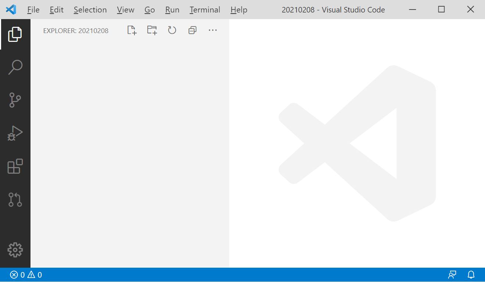


A continuació cal que obriu una nova finestra de terminal.
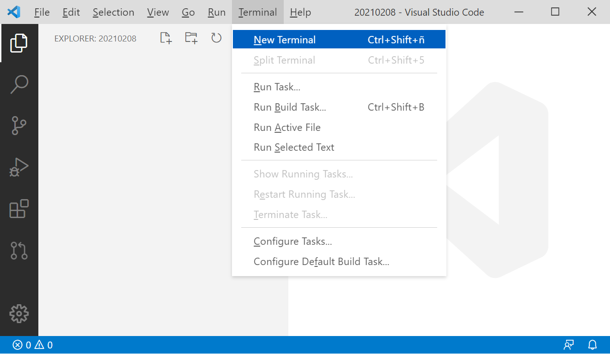


Un cop oberta la nova finestra de terminal, cal que escribiu la següent comanda de git:

``` git
git clone https://github.com/eapdagine/MP06_UF03_ActivitatAvaluativa_20210208.git examen20212008
```


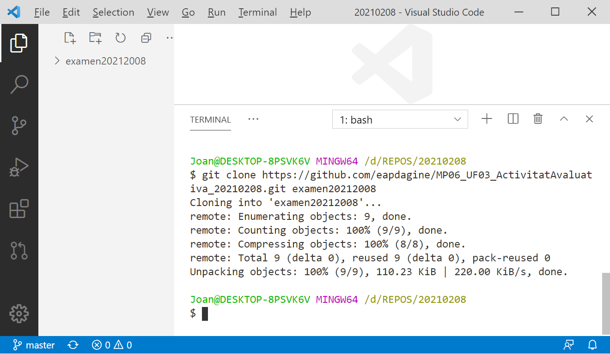


D'aquesta manera es crearà una carpeta anomenada examen20212008, a on trobareu tot el codi de l'activitat.

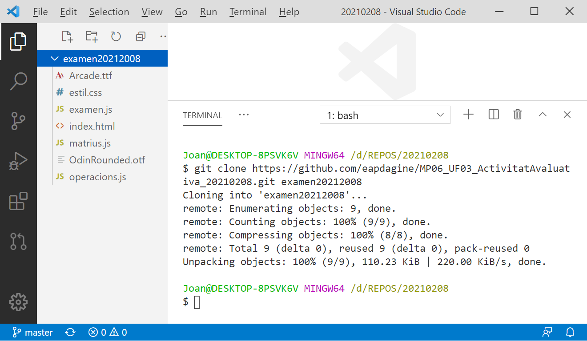

Ara cal que creeu un nou repositori al vostre github amb el nom ```examen20212008```

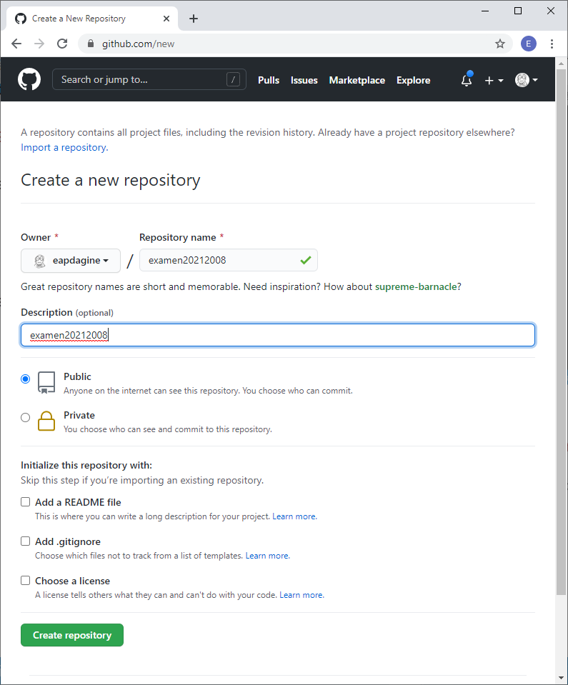

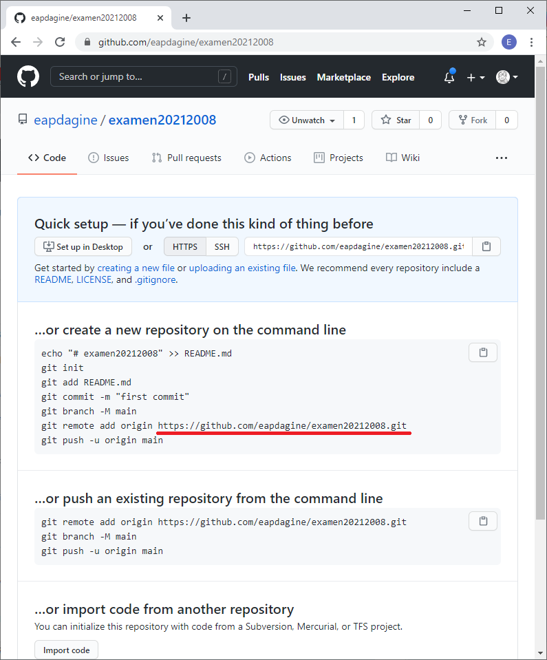

Arribat a aquest punt, és molt important que guardeu la **url** del vostre repositori.

En el meu exemple aquesta **URL** és ```https://github.com/eapdagine/examen20212008.git```

Ara cal preparar el vincle entre el **repositori local** i el vostre **reposiroti remot a github** que acabeu de crear. Per fer-ho cal que exeecuteu la següent comanda:

``` git
git remote add examen20212008 https://github.com/eapdagine/examen20212008.git
```

Per confirmar que hem creat correctament la connexió entre el repositori local i el remot, podeu executar la comanda:

```git
git remote get-url examen20212008
```

I la **URL** que us torna ha de ser la mateixa del vostre repositori remot al vostre **github**. 

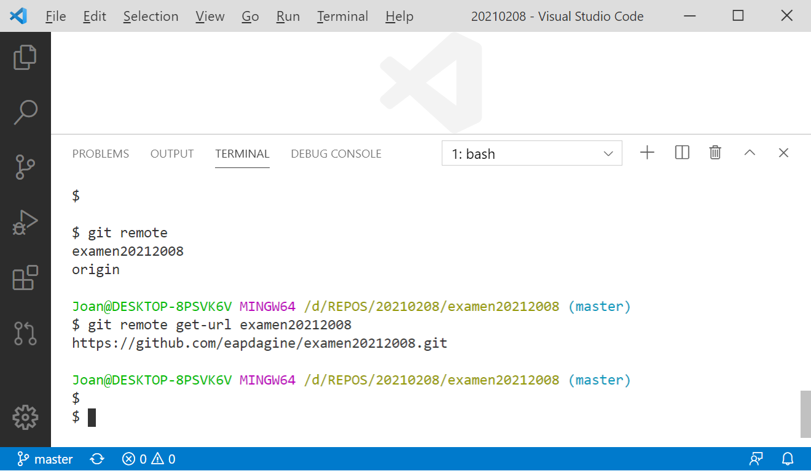

Ara ja podeu "pujar" el **repositori local** que acabeu de crear al vostre **reposiroti remot a github** que acabeu de crear.

Per fer-ho cal que executeu la següent comanda:

```git
git push -u examen20212008 master
```

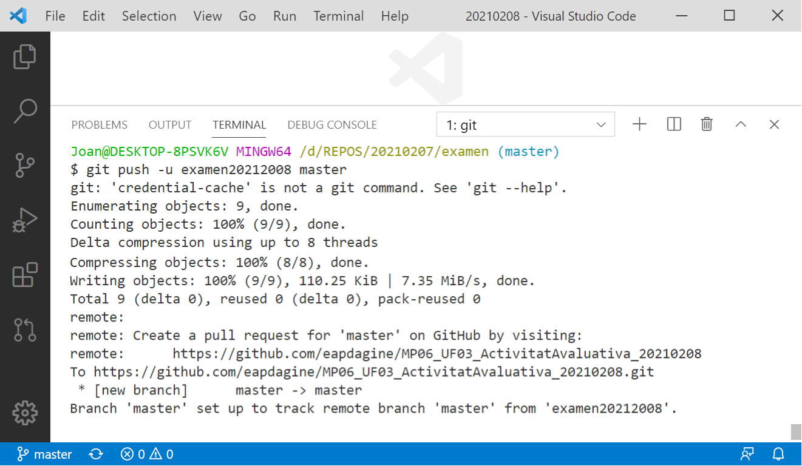

A partir d'ara ja teniu configurat el vostre entorn per començar a fer tots els passos que es demanen a l'activitat avaluativa.

## Així és com haurieu de veure la pàgina web, si heu seguit els passos correctament.

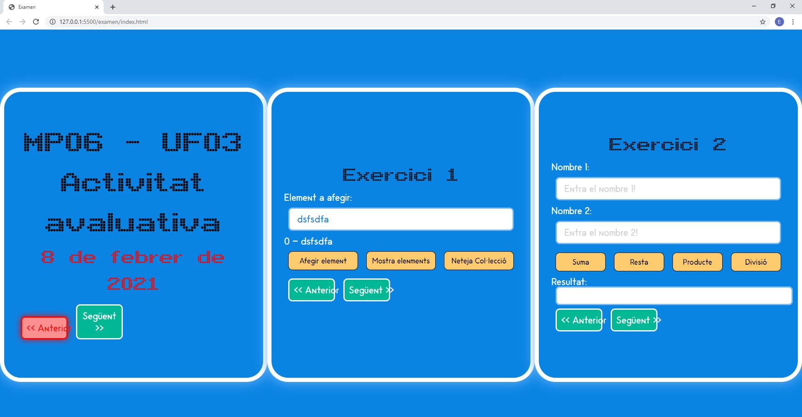


***
> <span style="color: red;  background-color: #fa9090;  font-size: 2.5em"><b>MOLT IMPORTANT!!</b></span><br><span style="color: black; font-size: 1.5em">
> **Per a totes les activitats cal que creeu una branca des de ```master```, i en acabar cal que feu un ```merge``` de la branca que heu creat per l'activitat, amb la branca ```master``` i cal que resoleu els conflictes que trobeu, si en trobeu cap.**
 </span>
***
> <span style="color: red;  background-color: #fa9090;  font-size: 2.5em"><b>MOLT IMPORTANT!!</b></span><br><span style="color: black; font-size: 1.5em">
> **Totes les funcions i variables que modifiqueu cal que les renombreu amb les vostres inicials al final de la funció o variable.**
</span><br><br>
> <span style="color: black; font-size: 1.5em">Per exemple:</span><br>
>  Si al fitxer original apareix una funció, com pot ser:
> ```js
> function mostraAlerta(){
>   let missatge = "Alerta!";
>   alert(missatge);
> }
> ```
> 
> I pel motiu que sigui us cal modificar-la, caldrà que modifiqueu el nom i guardar-la com:
> ```js
> function mostraAlertaJPC(){
>   let missatgeJPC = "Alerta!";
>   alert(missatgeJPC);
> }
> ```


> <div style=" background-color: #fa9090;">
> <span style="color: red;  background-color: #fa9090;  font-size: 2.5em"><b>MOLT MOLT MOLT MOLT IMPORTANT!!</b></span><br><span style="color: black; font-size: 1.5em; background-color: #fa9090;">
> <b>Totes aquelles activitats que no es facin creant una branca des de <span style="font-family: 'Courier New', Courier, monospace; color: blue;">master</span>, que en acabar <span style="color: red; font-size: 1.5em;">NO</span> estigui fet el <span style="font-family: 'Courier New', Courier, monospace; color: blue;">merge</span> de la branca que heu creat per l'activitat, amb la branca <span style="font-family: 'Courier New', Courier, monospace; color: blue;">master</span> <span style="color: red; font-size: 1.5em;">NO</span>, repeteixo, <span style="color: red; font-size: 1.5em;">NO</span> es tidràn en compte.</b>
 </span>
 </div>

***

<br><br><br><br>


# **Primera activitat** ***(2 punts)***

1. Crea una nova branca, des de **```master```**, amb el següent nom: **```enunciat01```***```<ElVostreCognomElVostreNom>```*
      
     - per exemple en el meu cas **Joan Pardo** la branca seria **```enunciat01PardoJoan```**.

1. Distribueix els fitxers seguint l'estructura estandard de carpetes, és a dir

     - les imatges dins d'una carpeta anomenada **```images```**,
     - els fitxers amb extensió **```.css```** dins d'una carpeta anomenada **```style```**,
     - els fitxers amb extensió **```.js```** dins d'una carpeta anomenada **```js```**,
     - i modifica els fitxers pertinents per a que segueixi funcionant tot correctament.

1. Fes un ***```commit```*** amb el missatge "**```Primer commit activitat 1!```**"

1. Puja el teu **repositori local** al vostre **reposiroti remot a github**.

1. Fes un ***```merge```*** de la branca  **```enunciat01```***```<ElVostreCognomElVostreNom>```* amb la branca ***```master```***. Cal que resolguis tots els conflictes que t'apareguin, si t'apareix algun conflicte.


<br><br><br><br>

***


# **Segona activitat** ***(2 punts)***

1. Crea una nova branca, des de **```master```**, amb el següent nom: **```enunciat02```***```<ElVostreCognomElVostreNom>```*
      
     - per exemple en el meu cas **Joan Pardo** la branca seria **```enunciat02PardoJoan```**.

1. Crea un nou fitxer ****```estil02```***```<ElVostreCognomElVostreNom>.css```*

1. Defineix dins del fitxer que acabes de crear, les classes **```elementVisible```** i ***```elementOcult```*** per fer que elements siguin visibles o ocults respectivament.  <span style="color: blue;  background-color: yellow;  font-size: 1.5em">**(1)**</span>

1. Modifica el fitxer **```index.html```**, afegint les classes que acabes de crear, per que en carregar la pàgina per primera vegada, només es vegi l'element **```article```** que conté el títol **```MP06 - UF03```**, i la resta d'articles no es vegin.

1. Fes un ***```commit```*** amb el missatge "**```Primer commit activitat 2!```**"

1. Puja el teu **repositori local** al vostre **reposiroti remot a github**.

1. Fes un ***```merge```*** de la branca  **```enunciat02```***```<ElVostreCognomElVostreNom>```* amb la branca ***```master```***. Cal que resolguis tots els conflictes que t'apareguin, si t'apareix algun conflicte.


<br><br>

> <span style="color: blue;  background-color: yellow;  font-size: 1.5em">**(1)**</span> <span style="color: red;  background-color: yellow;  font-size: 1.5em">**RECORDA!!!</span> Totes les funcions i variables que modifiqueu cal que les renombreu amb les vostres inicials al final de la funció o variable.**
</span><br>
> -  **```elementVisibleJPC```** <br>
> -  **```elementOcultJPC```**

<br><br>


<br><br>
*** 
En aquest punt la vostra web ha de tenir un aspecte similar a aquest.

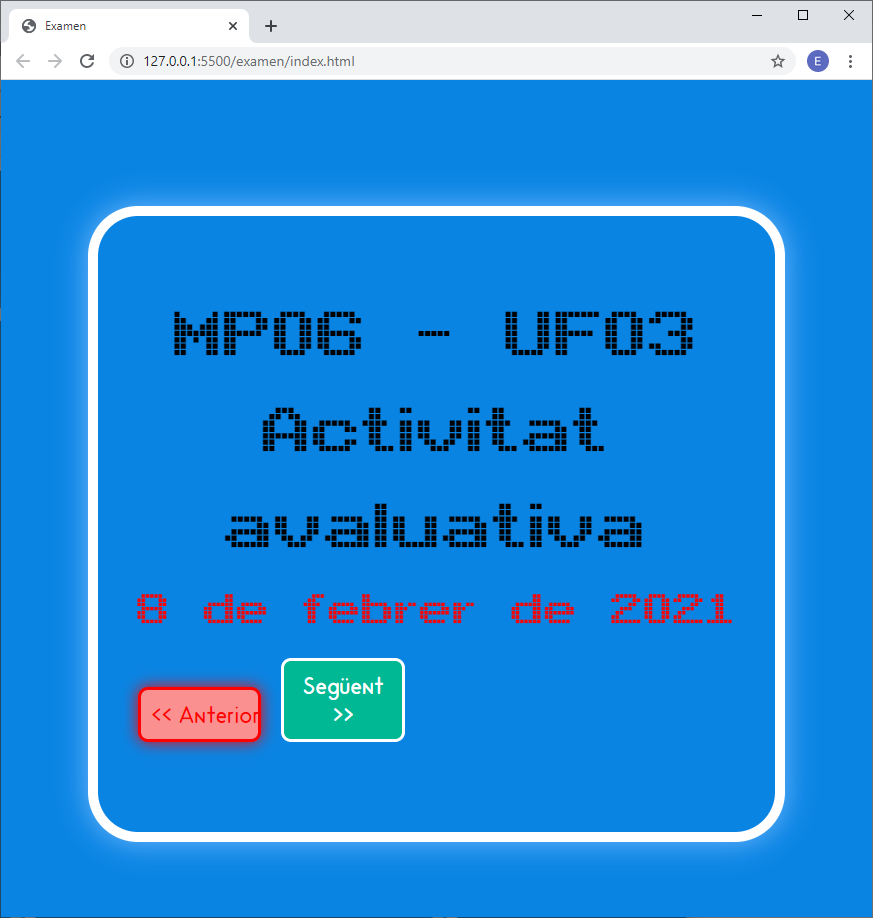


<br><br><br><br>

***


# **Tercera activitat** ***(2 punts)***

1. Crea una nova branca, des de **```master```**, amb el següent nom: **```enunciat03```***```<ElVostreCognomElVostreNom>```*
      
     - per exemple en el meu cas **Joan Pardo** la branca seria **```enunciat03PardoJoan```**.


1. Modifica l'estil perque els botons, ```Següent``` i ```Anterior```  apareguin com es veu a la següent imatge.

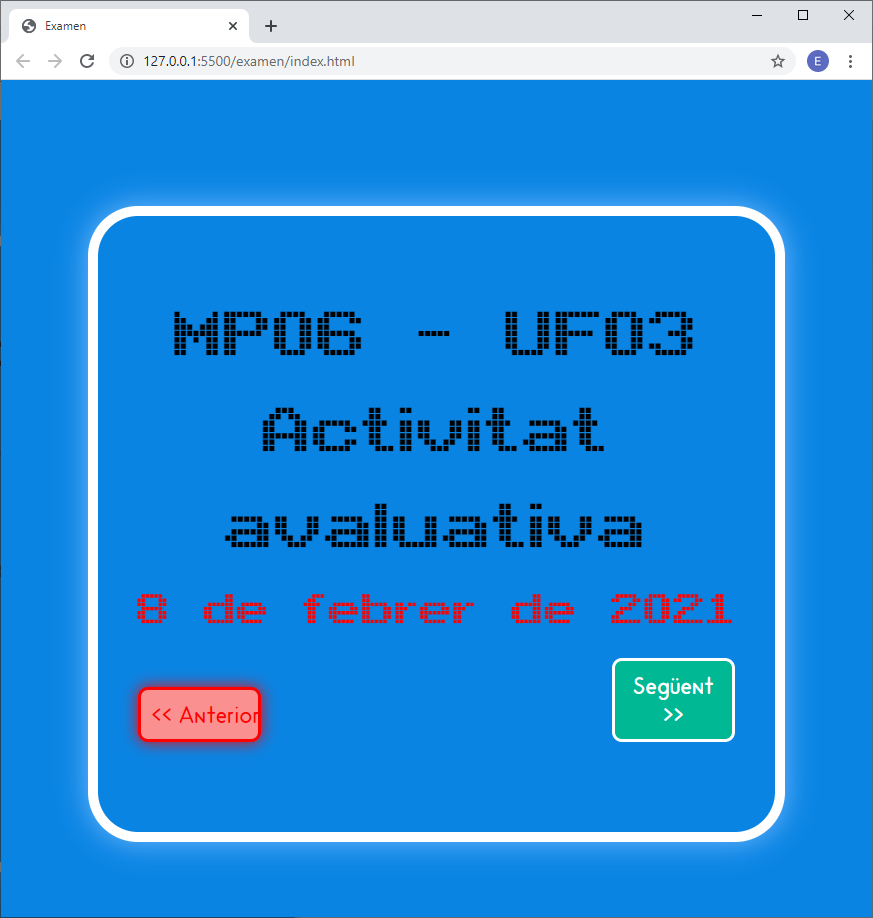

És a dir que els boton estiguin separats.

3. Fes un ***```commit```*** amb el missatge "**```Commit activitat 3!```**"


1. Puja el teu **repositori local** al vostre **reposiroti remot a github**.

1. Fes un ***```merge```*** de la branca  **```enunciat03```***```<ElVostreCognomElVostreNom>```* amb la branca ***```master```***. Cal que resolguis tots els conflictes que t'apareguin, si t'apareix algun conflicte.


<br><br><br><br>

***


# **Quarta activitat** ***(2 punts)***

1. Crea una nova branca, des de **```master```**, amb el següent nom: **```enunciat04```***```<ElVostreCognomElVostreNom>```*
      
     - per exemple en el meu cas **Joan Pardo** la branca seria **```enunciat04PardoJoan```**.


1.  Crea un nou fitxer ****```seguent```***```<ElVostreCognomElVostreNom>.js```*

1. Desenvolupa  dins del fitxer que acabes de crear, les funcions que creguis necessaries per fer que **NOMÉS** els botons **```Següent```** funcionin correctament.
  <span style="color: blue;  background-color: yellow;  font-size: 1.5em">**(1)**</span>

1. Modifica el fitxer **```index.html```**, afegint el necessari per poder exceutar les funcions que acabes de crear.

1. Fes un ***```commit```*** amb el missatge "**```Primer commit activitat 4!```**"

1. Puja el teu **repositori local** al vostre **reposiroti remot a github**.

1. Fes un ***```merge```*** de la branca  **```enunciat04```***```<ElVostreCognomElVostreNom>```* amb la branca ***```master```***. Cal que resolguis tots els conflictes que t'apareguin, si t'apareix algun conflicte.

<br>

> <span style="color: blue;  background-color: yellow;  font-size: 1.5em">**(1)**</span> <span style="color: red;  background-color: yellow;  font-size: 1.5em">**RECORDA!!!</span> Totes les funcions i variables que modifiqueu cal que les renombreu amb les vostres inicials al final de la funció o variable.**
</span><br>
> -  **```nomDeLaFucioJPC()```**


<br><br><br><br>

***


# **Cinquena activitat** ***(2 punts)***

1. Crea una nova branca, des de **```master```**, amb el següent nom: **```enunciat05```***```<ElVostreCognomElVostreNom>```*
      
     - per exemple en el meu cas **Joan Pardo** la branca seria **```enunciat05PardoJoan```**.


1.  Crea un nou fitxer ****```anterior```***```<ElVostreCognomElVostreNom>.js```*

1. Desenvolupa  dins del fitxer que acabes de crear, les funcions que creguis necessaries per fer que **NOMÉS** els botons **```Anterior```** funcionin correctament.
  <span style="color: blue;  background-color: yellow;  font-size: 1.5em">**(1)**</span>

1. Modifica el fitxer **```index.html```**, afegint el necessari per poder exceutar les funcions que acabes de crear.

1. Fes un ***```commit```*** amb el missatge "**```Primer commit activitat 5!```**"

1. Puja el teu **repositori local** al vostre **reposiroti remot a github**.

1. Fes un ***```merge```*** de la branca  **```enunciat05```***```<ElVostreCognomElVostreNom>```* amb la branca ***```master```***. Cal que resolguis tots els conflictes que t'apareguin, si t'apareix algun conflicte.

<br>

> <span style="color: blue;  background-color: yellow;  font-size: 1.5em">**(1)**</span> <span style="color: red;  background-color: yellow;  font-size: 1.5em">**RECORDA!!!</span> Totes les funcions i variables que modifiqueu cal que les renombreu amb les vostres inicials al final de la funció o variable.**
</span><br>
> -  **```nomDeLaFucioJPC()```**
